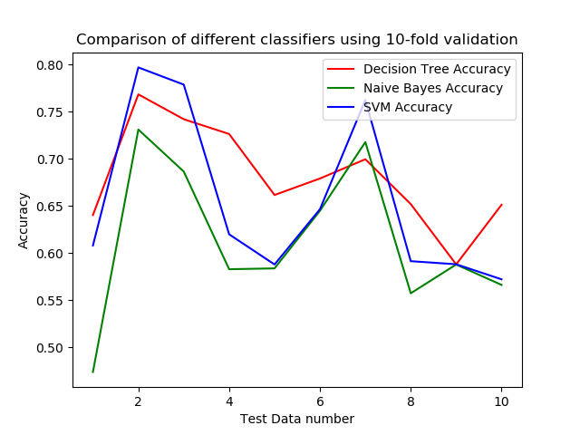

## DMML ASSIGNMENT 2
Submission: 6th October, 2019

Ekanshdeep Gupta, BMC201710  
Samarth Ramesh, BMC201722

## ABOUT THE PROGRAM

We created a Python3 program to create three classifiers using Decision Trees, Naive Bayes Algorithm and Support Vector Machines for the Connect-4 dataset: http://archive.ics.uci.edu/ml/datasets/Connect-4

We read as input the set of all legal positions in the game of connect-4 in which neither player has won yet, and in which the next move is not forced. The outcome class is the theoretical value of the game from the perspective of the first player.

To evaluate the classifiers, we used 10-fold cross validation on the given data. We then compared the accuracies of the different classifiers for each of the 10 splits.

## LIBRARIES

- numpy: for numpy arrays.
- sklearn: for decision trees.
- sklearn.naive_bayes: for Naive Bayes.
- sklearn.svm: for SVM.
- sklearn.model_selection: for K-fold cross validation.
- sklearn.metrics: for classification accuracy.
- matplotlib.pyplot: for plotting accuracies for all tests.
- time: for computing running time.

## ALGORITHM

The program accepts the connect-4 training data and parses it into numpy arrays. It then uses *KFold()* function to make 10 training/test splits of the data. The three clasifiers are then built using the *DecisionTreeClassifier()*, *MultinomialNB()* and *LinearSVC()* functions and are trained by the *fit()* function on each split. We then use the *predict()* function to compare the performance of the model on the test data. These acccuracies are then compared and graphed to get a comprehensive overview about the performance of the different models.

## ACCURACY AND RUNNING TIME

Following is the accuracy graph obtained by 10-fold cross validation of all the three classifiers:

<table>
    <tr>
      <td>Classifier</td>
      <td>Accuracy</td>
      <td>Time reqired</td>
    </tr>
    <tr>
      <td>Decision Tree</td>
      <td>0.6807</td>
      <td>31.7 sec</td>
    </tr>
    <tr>
      <td>Naive Bayes</td>
      <td>0.6131</td>
      <td>27.28 sec</td>
    </tr>
    <tr>
      <td>SVM</td>
      <td>0.6551</td>
      <td>331.37 sec</td>
    </tr>
</table>